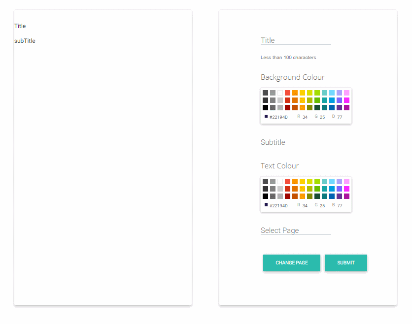

# What is editor-mobx?

[**Demo**](https://marktajima101.github.io/editor-mobx/) 

This ReactJS project demonstrates a simple element editor built with [mobx](https://mobx.js.org/README.html). It's function is to showcase
* Reactive rendering of elements & states 
* Basic example of handling the states of a rendered element via MobX State Management of objects & multi-dimentional arrays
* Creating & submitting new left card "pages" via appending new values into 2d pageList array
* Live rendering of text & colour change pre-submittion (*See local render data in AppStore.js*)
* Filtering keyed items for "re-rendering" of element state (title, sub title, text & background colour, etc)



#### Live show case (https://marktajima101.github.io/editor-mobx/)
##### *Currently requires MobX-DevTools, so live demo does not allow for change page yet. Please install locally.*

## Prerequisites

#### Npm v6.9.0 or compatible

Refer to https://www.npmjs.com/get-npm

### React v16.12.0 or compatible

Refer to [**create-react-app**](https://facebook.github.io/create-react-app/docs/getting-started)

#### MobX-DevTools
* [MobX Developer Tools for **Chrome**](https://chrome.google.com/webstore/detail/mobx-developer-tools/pfgnfdagidkfgccljigdamigbcnndkod)
* [MobX Developer Tools for **Firefox**](https://addons.mozilla.org/en-US/firefox/addon/mobx-devtools/)
* [See **MobX-DevTools**](https://github.com/mobxjs/mobx-devtools) 

```bash
#Standalone app for Safari, IE etc.
$ npm install --global mobx-devtools
```
###### *Currently, page list keys are not displayed, thus requires MobX-DevTools.*

## Installation

``` bash
#Clone the repo w/ 
$ git clone https://github.com/MarkTajima101/editor-mobx-eg.git my-project

#Navigate to the generated directory & install dependencies w/
$ npm install

#Start the app w/
$npm start
```
Open [http://localhost:3000](http://localhost:3000) to view it in the browser.


